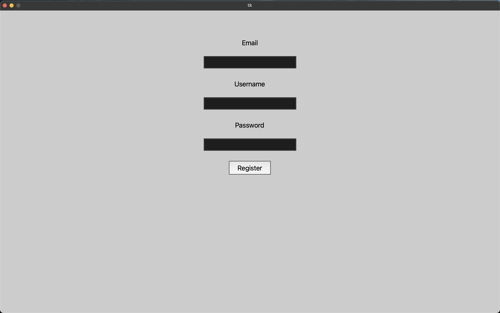
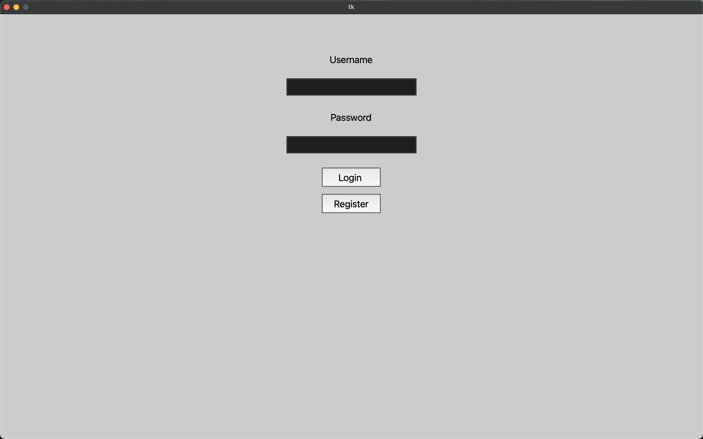
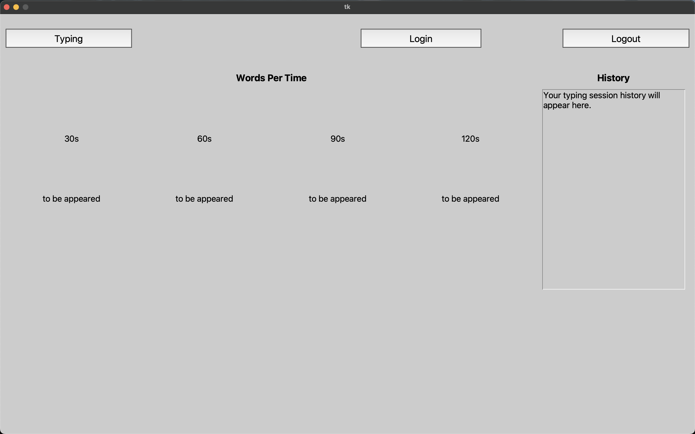
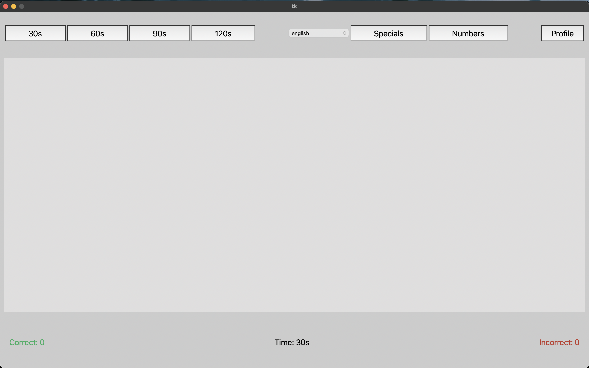

# Typing Speed ⌨️

Project for assessing the user's typing speed given a set of words, which may include special characters or/and numbers, using the Tkinter library.

---

## 📘 How Does It Work?

Typing Speed provides an interactive and different way to test your typing skills through a simple and intuitive Tkinter interface. The application 
includes essential yet impactful functionalities, such as user registration and login. While typing test results are not currently stored, 
this feature and some others are planned for future updates.

The application consists of four main interfaces (Frames), each serving a specific purpose:

### 1. Register  
- Allows new local users to register and store their credentials locally in a JSON file.  
- The registration process requires the following:  
  - **Email address** (e.g., `userprimary@gmail.com`).  
  - **Username** (e.g., `UserPrimary`).  
  - **Password** (e.g., `secure_password_538_#%$`).  
- To proceed, you have two options:  
  - Click the `Register` button.  
  - Press the `Return` or `Enter` key.  
- After submitting, one of two outcomes will occur:  
  1. If all fields are correctly filled, a confirmation message will appear, and you will be redirected to the Typing Test interface.  
  2. If any required fields are missing, an error message will prompt you to complete them.  

### 2. Log In  
- Allows registered users to access their profiles using valid credentials.  
- The login process requires:  
  - **Username**  
  - **Password**  
- Just like in the Register interface, you have two ways to proceed:  
  - Click the `Login` button.  
  - Press the `Return` or `Enter` key.  
- After submitting, one of the following will happen:  
  1. If the username exists and the password is correct, a confirmation message will appear, and you will be redirected to the Typing Test interface.  
  2. If the username exists but the password is incorrect, an error message will prompt you to try again.  
  3. If the username does not exist, an error message will appear, and the input fields will be cleared. Ensure that the username is registered before attempting to log in.  

### 3. Profile  
- Displays user-specific information, such as past test results (history) and best WPM across all available time settings.  
- Includes three buttons:  
  - `Typing`: Returns to the Typing Test interface.  
  - `Login`: Returns to the Login interface.  
  - `Logout`: Returns to the Login interface.  
  - **Note:** Although both `Login` and `Logout` redirect to the same interface, they are intended to serve different purposes.  
- Currently, user-specific information is not yet implemented, but it is planned for future updates.
 

### 4. Typing Test  
- Displays and manages the typing test by generating random words across four lines, along with a guide at the top of the interface.  
- Offers four time options to suit your preference:  
  - `30s`: Sets the test duration to 30 seconds (default).  
  - `60s`: Sets the test duration to 60 seconds.  
  - `90s`: Sets the test duration to 90 seconds.  
  - `120s`: Sets the test duration to 120 seconds.  
- Provides three additional configuration options for customizing the typing test:  
  - `Language`: Selects the preferred language. The default is English, and currently, only English and Spanish are available.  
  - `Specials`: Enables special characters in the typing test. Disabled by default.  
  - `Numbers`: Enables numbers in the typing test. Disabled by default.  
- Includes a `Profile` button, which redirects to the Profile interface.  
- Once all configurations are set, press the `Return` or `Enter` key to start the typing test.  
  - **Note:** During the test, you cannot stop, restart, or use any other buttons until the timer reaches 0.  
- When the test ends (timer reaches 0), a summary will display key performance metrics.  
- To start a new typing test, press the `Escape` or `Esc` key.  
  - **Note:** All previously selected configurations will remain unchanged, so there is no need to reconfigure them.

---
